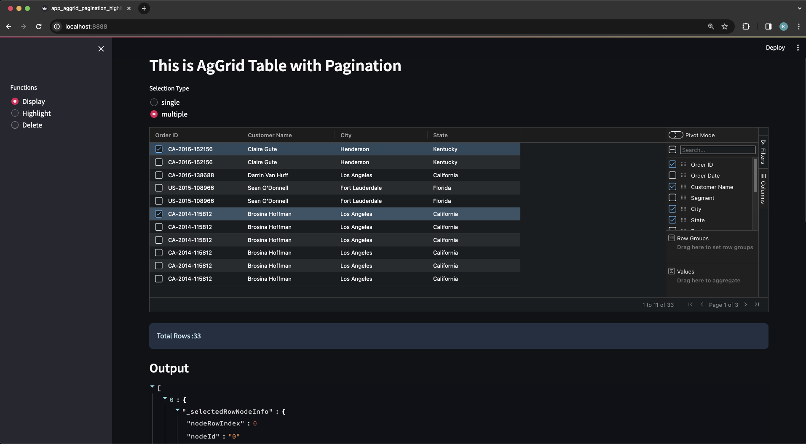
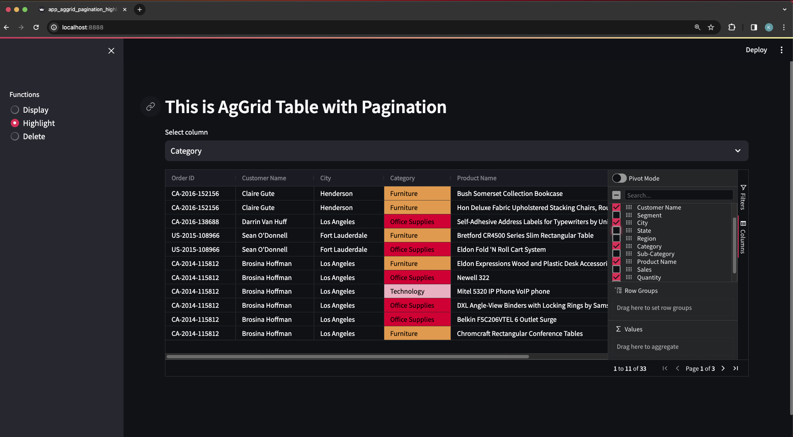
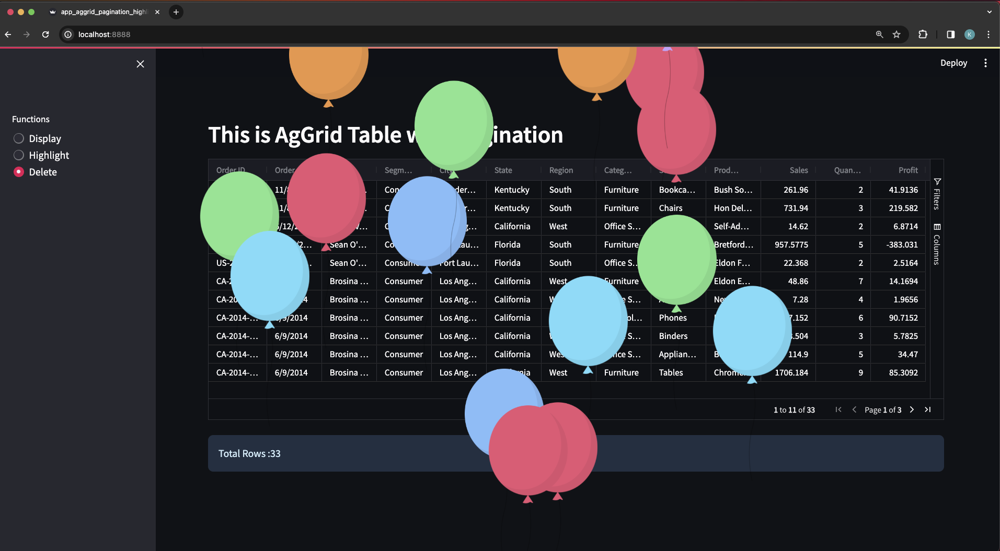

    

---

### References : 
components streamlit : --> https://components.streamlit.app

### Begin Project:

    ❯ cd <foldername-projects>

    ❯ python -m venv venv

    ❯ source ./venv/bin/activate

    ❯ pip install streamlit

    ❯ pip install streamlit-option-menu

### another packages for single compilations:

    ❯ pip install opencv-python

    ❯ pip install qrcode

    ❯ pip install streamlit-aggrid

### menjalankan project:
❯ streamlit run ./<nama-file>.py  --server.port 8888

----

### app_aggrid_pagination_highlight.py

    

    

    

---

&#x1FAA7; Notes : 

    ❯ pip list

        Package                   Version
        ------------------------- -----------
        altair                    5.2.0
        attrs                     23.2.0
        blinker                   1.7.0
        cachetools                5.3.3
        certifi                   2024.2.2
        charset-normalizer        3.3.2
        click                     8.1.7
        gitdb                     4.0.11
        GitPython                 3.1.42
        idna                      3.6
        importlib-metadata        7.0.1
        Jinja2                    3.1.3
        jsonschema                4.21.1
        jsonschema-specifications 2023.12.1
        markdown-it-py            3.0.0
        MarkupSafe                2.1.5
        mdurl                     0.1.2
        numpy                     1.26.4
        packaging                 23.2
        pandas                    2.2.1
        pillow                    10.2.0
        pip                       22.0.4
        protobuf                  4.25.3
        pyarrow                   15.0.0
        pydeck                    0.8.1b0
        Pygments                  2.17.2
        python-dateutil           2.9.0.post0
        python-decouple           3.8
        pytz                      2024.1
        referencing               0.33.0
        requests                  2.31.0
        rich                      13.7.1
        rpds-py                   0.18.0
        setuptools                58.1.0
        six                       1.16.0
        smmap                     5.0.1
        streamlit                 1.31.1
        streamlit-aggrid          0.3.4.post3
        streamlit-option-menu     0.3.12
        tenacity                  8.2.3
        toml                      0.10.2
        toolz                     0.12.1
        tornado                   6.4
        typing_extensions         4.10.0
        tzdata                    2024.1
        tzlocal                   5.2
        urllib3                   2.2.1
        validators                0.22.0
        zipp                      3.17.0